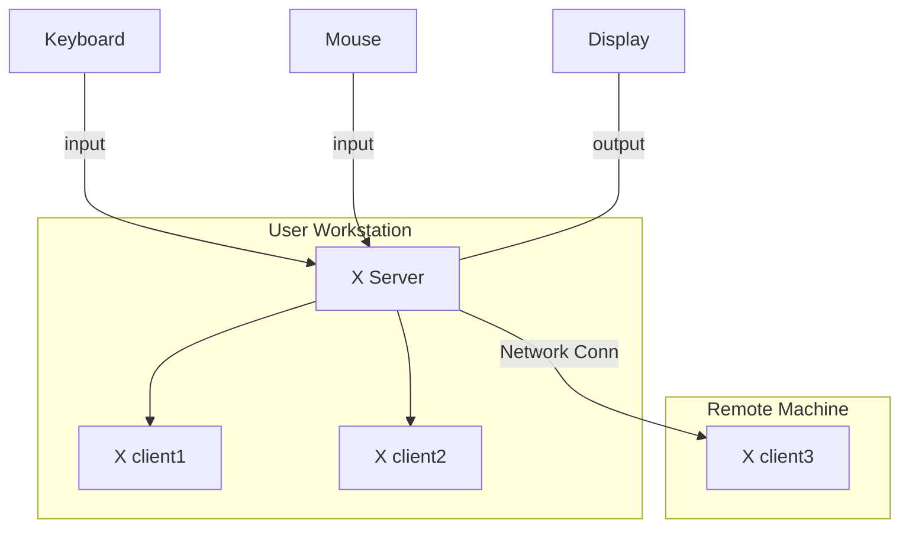

# Fract'ol

 This project is about creating graphically beautiful fractals.

    
    
    
    
    

___

<h3>Table o'Contents</h3>

<!-- mtoc-start -->

* [About](#about)
  * [`MinilibX`](#minilibx)
    * [X-Window System](#x-window-system)
    * [X client-server Architecture](#x-client-server-architecture)
  * [The Math ](#the-math-)
    * [Complex Numbers](#complex-numbers)
    * [Complex Arithmetic](#complex-arithmetic)
      * [Addition](#addition)
      * [Subtraction](#subtraction)
      * [Multiplication](#multiplication)
        * [Complex * Real](#complex--real)
        * [Complex * Complex](#complex--complex)
* [Implementation](#implementation)
  * [`main.c`](#mainc)
* [Usage](#usage)
* [Footnotes](#footnotes)
* [License](#license)

<!-- mtoc-end -->

## About

**Fract'ol** is the first graphics project of the Common Core curriculum. It is a simple computer graphics program using `minilibx`. It is an opportunity to learn how to use the mathematical notion of **complex numbers**, have a first contact with the concept of **optimization** in computer graphics, and **event handling**. 

___
### `MinilibX`

**MinilibX** is a small library, a simplified version of **XLib** (X11R6) written in C , designed to introduce students to the **X-Window System**. [^1]

#### X-Window System

The **X-Window System** is an architecture independent windowing system for bitmap displays that provides a basic framework for creating graphical user interfaces. [^2]

It enables users to draw and move windows on a display using the mouse and keyboard.

> [!Note]
>
> In computing, a `bitmap` (also known as `bit array` or `bitmap index`) is a mapping from a given domain (for instance, a range of integers) to bits. [^3]

#### X client-server Architecture

X is based on a client-server model: 

> one **X server** connects to multiple **X client** programs.

The X Server receives requests to output graphics on the display (through windows) and sends back user input (from a keyboard, mouse, etc).

> [!Note]
>
> There are many implementations of the X Window System (Xlib), minilibx being just one among many following the X Consortium standard; [^4]
> - [Xlib : X Consortium Standard](https://www.x.org/releases/current/doc/libX11/libX11/libX11.html)

____
### The Math 

#### Complex Numbers

`Complex numbers` are numbers in the form `a + bi` where `a` is the real part and `b` is the imaginary part and `i` is the imaginary unit, defined by the equation $i^2 = -1$.

The real part of a complex number is mapped to the `x` axis and the imaginary part to the `y` axis describing a 2D grid, the `Complex Plane`. 

#### Complex Arithmetic

Like with real numbers, we can perform **arithmetic** on complex numbers.

##### Addition

> $(a + bi) + (c + di) = (a + c) + (b + d)i$

Example of how to add two complex numbers:

> $((3 - 4i) + (2 + 5i)) =$
>
> $((3 + 2) + (-4 + 5)i) =$
>
> $(5 + i)$

##### Subtraction

> $(a + bi) - (c + di) = (a - c) + (b - d)i$

##### Multiplication

Multiplication is similar to multiplying binomials but with complex numbers we work with the real and imaginary parts separately.

###### Complex * Real

> $c(a + bi) = (c * a) + (c * b)i$

Example:

> $3(6 + 2i) =$
>
> $(3 * 6) + (3 * 2i) =$ # Distribute
>
> $(18 * 6i)$ # Simplify

###### Complex * Complex

> $(a + bi)(c + di) = ac + adi + bci + bdi^2$

* Because $i^2 = -1$, we can simplify the expression to:

> $(a + bi)(c + di) = ac + adi +bci - bd$

* Simplifying, we combine the real parts, and then the imaginary parts:

> $(a + bi)(c + di) =$
> 
> $(ac - bd) + (ad + bc)i$

Example:

> $(4 + 3i)(2 - 5i) =$
>
> $(4 * 2) + (4 * (-5i)) + (3i * 2) + (3i * (-5i)) =$
>
> $8 - 20i + 6i - 15i^2 =$
>
> $8 + 15 - 20i + 6i =$
>
> $(23 - 14i)$

___
## Implementation

### `main.c`

___
## Usage

___
# Footnotes

[^1]: [minilibx-linux repo : 42Paris](https://github.com/42Paris/minilibx-linux)
[^2]: [X-Window System : Wikipedia](https://en.wikipedia.org/wiki/X-Window_System)
[^3]: [Bitmap : Wikipedia](https://en.wikipedia.org/wiki/Bitmap)
[^4]: [Xlib : Wikipedia](https://en.wikipedia.org/wiki/Xlib)
[^5]: [Xlib Keysyms : Oreilly.com](https://www.oreilly.com/library/view/xlib-reference-manual/9780937175262/16_appendix-h.html)
___
## License

This work is published under the terms of <a href="https://github.com/PedroZappa/42_fractol/blob/main/LICENSE">42 Unlicense</a>.

(<a href="#readme-top">get to top</a>)

