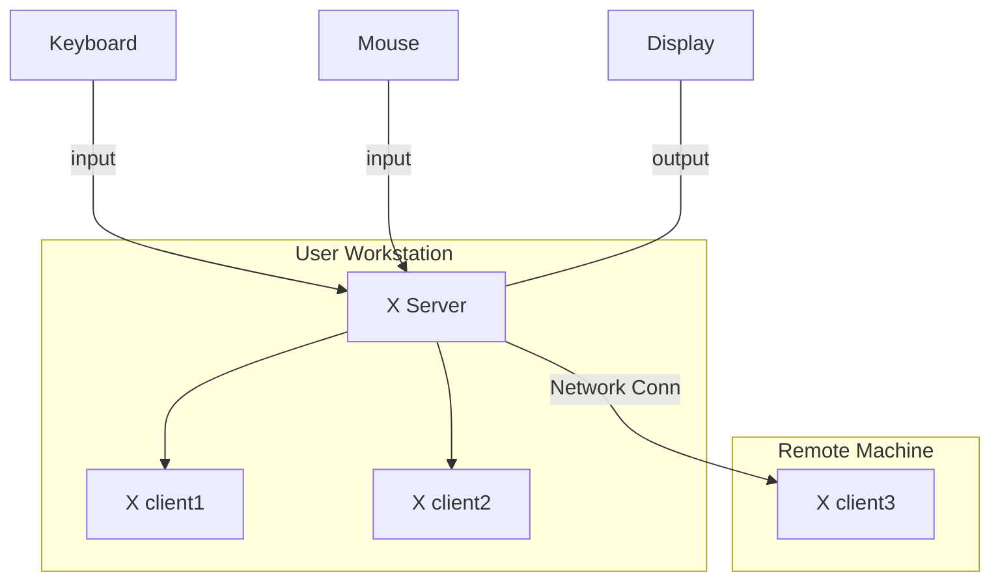

<a name="readme-top"></a>
<div align="center">

# Fract'ol

 This project is about creating graphically beautiful fractals.

<p>
    
    
    
    
    
</p>

___

<h3>Table o'Contents</h3>

</div>

<!-- mtoc-start -->

* [About 📌](#about-)
  * [Mandatory Features](#mandatory-features)
  * [Bonus Features](#bonus-features)
  * [MinilibX 🪟](#minilibx-)
    * [X-Window System](#x-window-system)
    * [X client-server Architecture](#x-client-server-architecture)
  * [Complex Numbers](#complex-numbers)
  * [Complex Arithmetic](#complex-arithmetic)
    * [Addition](#addition)
    * [Subtraction](#subtraction)
    * [Multiplication](#multiplication)
      * [Complex * Real](#complex--real)
      * [Complex * Complex](#complex--complex)
    * [Expanding a Complex Number](#expanding-a-complex-number)
  * [Complex Plane](#complex-plane)
  * [Fractals](#fractals)
    * [Julia Set](#julia-set)
    * [Mandelbrot Set](#mandelbrot-set)
    * [Tricorn Set](#tricorn-set)
    * [Burning Ship Set](#burning-ship-set)
* [Implementation 📜](#implementation-)
  * [`t_display` Structure](#t_display-structure)
  * [`ft_args.c` : Argument Parsing Functions](#ft_argsc--argument-parsing-functions)
    * [`ft_no_args()`  ](#ft_no_args--)
    * [`ft_args()`  ](#ft_args--)
      * [`ft_select_fractal()`](#ft_select_fractal)
      * [`ft_set_args()`](#ft_set_args)
  * [`ft_init.c` : Initialization Functions](#ft_initc--initialization-functions)
    * [`ft_init_display()`](#ft_init_display)
    * [`ft_init_events()`](#ft_init_events)
* [Usage 🏁](#usage-)
* [Footnotes](#footnotes)
* [License](#license)

<!-- mtoc-end -->

## About 📌

**Fract'ol** is the first graphics project of the Common Core curriculum. It is a simple computer graphics program using `minilibx`. It is an opportunity to learn how to use the mathematical notion of **complex numbers**, have a first contact with the concept of **optimization** in computer graphics, and **event handling**. 

___
### Mandatory Features

* **General**
	* The program must take the type of the fractal to be displayed as a parameter and any other relevant option.
	* The program must display the fractal in the window powered by `minilibx`.
	* The project must contain a `Makefile` that compiles all sources. It must not relink.
	* Global variables are forbidden.

* **Rendering**
	* The program must offer the Julia and Mandelbrot sets.
	* The mouse wheel zooms in and out almost infinitely, within the limits of the computer.
	* A different Julia set must be rendered if the program is passed the appropriate parameters.
	* A parameter passed on startup must be the type of the fractal to be rendered.
		* Adding more parameters is optional.
		If no parameter is provided, or the parameters are invalid, the list displays the help page and exits cleanly.
	* A few different color schemes must be implemented.

* **Graphic Management**
	* The program has to display the image in a window.
	* The management of the window must remain smooth.
	* Pressing `ESC` must close the window and exit the program in a clean way.
	* Clicking on the cross on the top window frame must have the same effect.
	* It is mandatory to use `images` from `minilibx`.

___
### Bonus Features

* One extra fractal.
* The zoom follows the mouse position.
* Moving the view by pressing the arrow keys.
* Make the color range shift

___
### MinilibX 🪟

**MinilibX** is a small library, a simplified version of **XLib** (X11R6) written in C , designed to introduce students to the **X-Window System**. [^1]

___
#### X-Window System

The **X-Window System** is an architecture independent windowing system for bitmap displays that provides a basic framework for creating graphical user interfaces. [^2] It enables users to draw and move windows on a display using the mouse and keyboard.

> [!Note]
>
> In computing, a `bitmap` (also known as `bit array` or `bitmap index`) is a mapping from a given domain (for instance, a range of integers) to bits. [^3]

___
#### X client-server Architecture

X is based on a client-server model: 

* one **X server** connects to multiple **X client** programs.


The X Server receives requests to output graphics on the display (through windows) and sends back user input (from a keyboard, mouse, etc).

> [!Note]
>
> There are many implementations of the X Window System (Xlib), minilibx being just one among many following the X Consortium standard; [^4]
> - [Xlib : X Consortium Standard](https://www.x.org/releases/current/doc/libX11/libX11/libX11.html)

____
### Complex Numbers

`Complex numbers` are numbers in the form `(a + bi)` where:

* `a` is the real part:
* `b` is the imaginary part;
* `i` is the imaginary unit, defined by the equation $i^2 = -1$.

> [!Note]
>
> $i = \sqrt-1$

___
### Complex Arithmetic

Like with real numbers, we can perform **arithmetic** on complex numbers.

___
#### Addition

> $(a + bi) + (c + di) = (a + c) + (b + d)i$

Example of how to add two complex numbers:

> $((3 - 4i) + (2 + 5i)) =$
>
> $((3 + 2) + (-4 + 5)i) =$
>
> $(5 + i)$

___
#### Subtraction

> $(a + bi) - (c + di) = (a - c) + (b - d)i$

___
#### Multiplication

Multiplication is similar to multiplying binomials but with complex numbers we work with the real and imaginary parts separately.

##### Complex * Real

> $c(a + bi) = (c * a) + (c * b)i$

Example:

> $3(6 + 2i) =$
>
> $(3 * 6) + (3 * 2i) =$ # Distribute
>
> $(18 * 6i)$ # Simplify

___
##### Complex * Complex

> $(a + bi)(c + di) = ac + adi + bci + bdi^2$

* Because $i^2 = -1$, we can simplify the expression to:

> $(a + bi)(c + di) = ac + adi + bci - bd$

* Simplifying, we combine the real parts, and then the imaginary parts:

> $(a + bi)(c + di) =$
> 
> $(ac - bd) + (ad + bc)i$

Example:

> $(4 + 3i)(2 - 5i) =$
>
> $(4 * 2) + (4 * (-5i)) + (3i * 2) + (3i * (-5i)) =$
>
> $8 - 20i + 6i - 15i^2 =$
>
> $8 + 15 - 20i + 6i =$
>
> $(23 - 14i)$

___
#### Expanding a Complex Number

Here is an example on how to expand a squared complex number:

> $(a + bi)^2 =$
>
> $(a * a) + (a * bi) + (a * bi) - (bi * bi)$
>
> $(a^2 - bi^2) + 2(a * bi))$

* The real part is $(a^2 - b^2)$;
* The imaginary part is $2(a * bi)$;

___
### Complex Plane

We can take complex numbers and plot them in a plane known as the `Complex Plane`.

> This plane is formed by the mapping of the real and imaginary parts of a complex number to a Cartesian coordinate system. The real part mapped to the `x`-axis and the imaginary part to the `y`-axis.

___
### Fractals

> Fractals are infinitely complex self-similar patterns across multiple scales.

Generated by:

* Initializing a complex number $z = (x + yi)$ where: $i^2 = -1$
* `x` and `y` are image pixel coordinates mapped to a range between -2 to 2.
* A formula is iterated until the value of `|z|` becomes greater than `2`.
	* If the point never escapes the range it IS considered to be part of the set.
	* If the point escapes the range it means it is NOT part of the set.
	* The color of each pixel is determined by the number of iterations it took to escape the set.

___
#### Julia Set

> **Formula** :  $f(z_{n+1}) = z_n^2 + c$

There are infinitely many Julia sets. To generate them, we use the same complex number `c` for all pixels. 

* For each pixel in the image:
	* `z` is initially set to 0.
	* `z` is updated repeatedly following the formula $z_{n+1} = z^2 + c$.
	* `c` is a complex number that seeds a specific Julia set.

___
#### Mandelbrot Set

> **Formula** :  $f(z_{n+1}) = z_n^2 + c$

For the Mandelbrot set, we use different complex numbers for each pixel. It is the one map to all Julia sets.

* For each pixel in the image:
	* `z` is initially set to 0.
	* `z` is updated repeatedly following the formula $z_{n+1} = z^2 + c$.
	* `c` is a complex constant defined as: $c = (x + yi)$ where: $i^2 = -1$

___
#### Tricorn Set

> **Formula** :  $f(z_{n+1}) = \overline{z_n}^2 + c$

The Tricorn fractal is a variant of the Mandelbrot set and is characterized by its triangular shape. It is generated by using a slightly different formula where:
* The complex conjugate of `z` is squared instead of `z` itself.
* The complex conjugate of `z` is represented by $\overline{z_n}$ 
* `c` is a complex constant that varies for each pixel in the image.

> [!Note]
> To get the `complex conjugate` of a complex number `(a + bi)`, we simply invert the sign of the imaginary part like so: `(a - bi)`
>
> For example: The conjugate of `(4 + 7i)` is `(4 - 7i)`.
___
#### Burning Ship Set

> $f(z_{n+1}) = (|{Re}(z_n)| + |{Im}(z_n)|i)^2 + c$

The Burning Ship Set is generated by the above equation where:
* $z_n$ is the current complex number;
* `c` is a complex constant (just like in the Julia Set formula);
* $z_{n+1}$ is the next complex number in the sequence;
* The real and imaginary components are set to their absolute values before squaring at each iteration.

This modification results in the distinctive "burning ship" appearance of the fractal.
___
## Implementation 📜

Before anything else, the `main()` function declares a `t_display` variable named `display` that stores all the necessary data, conveniently packed to be passed around the program.

___
### `t_display` Structure
```c 
typedef struct s_display
{
	// mlx Data
	void        *mlx_conn;   // Stores pointer to mlx connection
	void        *mlx_win;    // Stores pointer to mlx window
	t_img       img;         // Stores the image data
	int         width;       // Stores the width of the window
	int         height;      // Stores the height of the window
	t_range     win_size;    // Stores the size of the window
	double      x_offset;    // Stores how much to shift when moving the view 
	double      y_offset;    // Stores how much to shift when moving the view
	double      zoom;        // Stores the zoom factor
	// Fractal Data
	char        *name;       // Stores the name of the fractal
	int         set;         // Stores the type of fractal
	long        iter;        // Stores the number of iterations
	t_complex   z;           // Stores z for Mandelbrot/Julia/Tricorn/Burning Ship
	t_complex   c;           // Stores c for Mandelbrot/Tricorn/Burning Ship
	t_complex   c_julia;     // Stores c for Julia
	t_complex   z_newton;    // Stores z for Newton
	t_range     frac_range;  // Stores the range of the complex plane
	double      escape;      // Stores the complex plane escape value
	double      newton_esc;  // Stores escape value for Newton
	t_range     color_iter;  // Stores a range of 0 to n iterations 
	t_range     color_range; // Stores a range from black to white
	int         color;       // Stores a color for the Newton fractal
}               t_display;
```
___
### `ft_args.c` : Argument Parsing Functions

> The main logic for argument parsing can be found inside the `ft_args.c` file.

`ft_no_args()` and `ft_args()` are used to parse the input arguments and ensure that if there is something wrong the program exits correctly (without memory leaks).
```c
if (argc < 2)
	return (ft_no_args());
else if (!ft_args(&display, argc, argv))
	exit(EXIT_FAILURE);
```
___
#### `ft_no_args()`  

> If the program is passed no arguments, it prints an error to `stderr`, displays the help page and exits cleanly.

___
#### `ft_args()`  

> Checks if the arguments passed are valid. 

* First checks if the fractal type is valid.
* Then attempts to set the input arguments:

```c
int	ft_args(t_display *d, int argc, char **argv)
{
	if (!ft_select_fractal(d, argc, argv))
		return (ft_invalid_args(argv[1]));
	if (!ft_set_args(d, argc, argv))
		return (0);
	return (1);
}
```
___
##### `ft_select_fractal()`

This function checks if the fractal type is valid. 
* If it is, it calls `ft_set_fractal()` and outputs 1.
* If it is NOT valid it outputs 0.

___
##### `ft_set_args()`

Here we make sure we got the right number of arguments and check if they are the right type before the program initializes anything.

* First checks the iterations argument:
	* If the 2nd argument is a valid input for the number of iterations, we set it to `d->iter`. In case it is a negative value a default value is set instead.
	* Otherwise the program prints an error to `stderr` and exits.

* Then we check for the Julia case in which we get a complex number as the third and fourth arguments.
	* If the input arguments are a valid doubles we set them to `d->c_julia.r` and `d->c_julia.i`.
	* Otherwise the program prints an error to `stderr` and exits.

___
### `ft_init.c` : Initialization Functions

> After all validation tests are passed, the program calls `ft_init_display()`. 

___
#### `ft_init_display()`

It initializes:
* the `mlx` connection into `d->mlx_conn` by calling `mlx_init()`;
* the `mlx` window into `d->mlx_win` by calling `mlx_new_window()`;
* the image pointer into `d->img.img` by calling `mlx_new_image()`;
* the image pixels into `d->img.pix` by calling `mlx_get_data_addr()`;

> All these calls are properly protected by calls to cleanup functions in case a initialization error problem arises.

After everything is properly allocated we proceed to initialize the **event handling** functionality.

___
#### `ft_init_events()`

This function initializes three **event handlers** to be triggered when certain events are received:
* `ft_kill_handle()`;
	* Listens for `DestroyNotify` event;
	* Destroys the image data;
	* Destroys the `mlx` window;
	* Destroys the `mlx` connection;
	* Frees the `t_display` pointer to the `mlx_conn`;
* `ft_handle_keys()`;
	* Listens for `KeyPress` events;
	* If <kbd>Escape</kbd> is received, it exits by calling `ft_kill_handle()`;
	* If the arrow keys are pressed, `ft_handle_offsets()` is called;
	* If <kbd>PageUp</kbd> or <kbd>PageDown</kbd> are pressed, the `d->iter` is increased or decreased by 1 respectively;
	* If <kbd>Space</kbd>, <kbd>1</kbd>, <kbd>2</kbd>, <kbd>3</kbd>, <kbd>4</kbd>, <kbd>5</kbd> are pressed, `ft_swith_set()` is called.
	* If <kbd>Left-Shift</kbd>, <kbd>Right-Shift</kbd>, <kbd>r</kbd>, <kbd>g</kbd> or <kbd>b</kbd> are pressed, `ft_switch_color()` is invoked.
	* Else if the key press received is not being handled, a message with the keysym value is printed to `stdout`.
	* If an event was successfully caught `ft_render()` is called causing a re-render.
	
* `ft_handle_mouse()`;


___
## Usage 🏁

___
# Footnotes

[^1]: [minilibx-linux repo : 42Paris](https://github.com/42Paris/minilibx-linux)
[^2]: [X-Window System : Wikipedia](https://en.wikipedia.org/wiki/X-Window_System)
[^3]: [Bitmap : Wikipedia](https://en.wikipedia.org/wiki/Bitmap)
[^4]: [Xlib : Wikipedia](https://en.wikipedia.org/wiki/Xlib)
[^5]: [Xlib Keysyms : Oreilly.com](https://www.oreilly.com/library/view/xlib-reference-manual/9780937175262/16_appendix-h.html)
___
## License

This work is published under the terms of <a href="https://github.com/PedroZappa/42_fractol/blob/main/LICENSE">42 Unlicense</a>.

<p align="right">(<a href="#readme-top">get to top</a>)</p>

